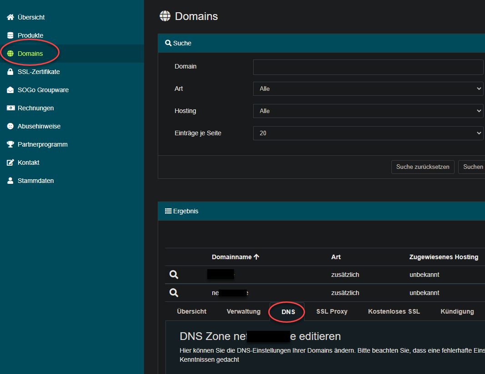
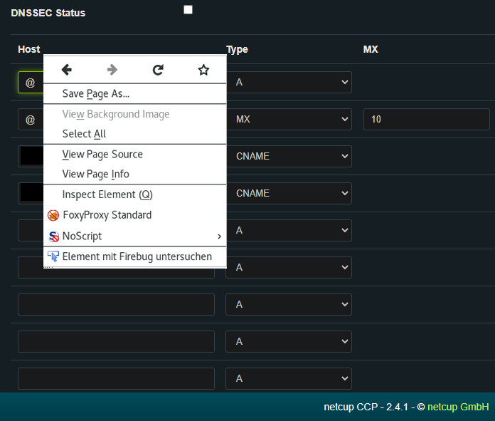
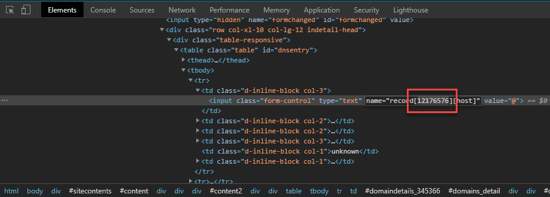

# UNMAINTAINED ncdapi (inofficial netcup DNS API Client)

This script is currently unmaintained. Due to the fact that changes need at least 10 minutes to be applied and the api still does not support setting a ttl per record.


## WARNING
This client is well tested, but it is possible that some actions provoke a bug, so the use of this client is on your own risk and may result in lost of your zone data.

### Requirements
- jq (a json parser)
- curl

### Credentials
To use this script you must replace the values at beginning of the script with your:
```
#Credentials
apikey=YOUR_API_KEY
apipw=YOUR_API_PASSWORD
cid=YOUR_CUSTOMERNUMBER
```
### How to use
```
IMPORTANT: Only ONE Argument like -N or -dN
If you have a string which is including spaces use "around your string"
  
-d   Debug Mode         ncdapi.sh -d...
-N   NEW Record         ncdapi.sh -N HOST DOMAIN RECORDTYPE DESTINATION [PRIORITY]
-M   MOD Record         ncdapi.sh -M ID HOST DOMAIN RECORDTYPE DESTINATION [PRIORITY]
-D   DEL Record         ncdapi.sh -D ID HOST DOMAIN RECORDTYPE DESTINATION [PRIORITY]
-g   get all Records	ncdapi.sh -g DOMAIN
-b   backup from Zone	ncdapi.sh -b DOMAIN
-R   Restore Zone	ncdapi.sh -R FILE
-s   get SOA    	ncdapi.sh -s DOMAIN
-S   change SOA    	ncdapi.sh -S DOMAIN TTL REFRESH RETRY EXPIRE DNSSECSTATUS
-l   list all Domains	ncdapi.sh -l
-h   this help

Examples:
New CAA Record:  ncdapi.sh -N @ example.com CAA "0 issue letsencrypt.org"
New   A Record:  ncdapi.sh -N @ example.com A 127.0.0.1
New  MX Record:  ncdapi.sh -N @ example.com MX mail.example.com 20
Get all records: ncdapi.sh -g example.com
Delete Record:   ncdapi.sh -D 1234567 @ example.com A 127.0.0.1
Change SOA:	 ncdapi.sh -S example.com 3600 28800 7200 1209600 true
```

### Functions
* add new record
* modify record/SOA
* delete record
* get all records/domains
* backup/restore of zone + SOA
* If the api returns a failure the session will automatically make invalid and the plain JSON from the api will be written to stdout

### TODO
- DynDNS capability if the api get the possibility for per record TTL in near future
- ...

## How to obtain the DNS entry ID?

First, login to the [netcup](https://netcup.de) website. Navigate to "Domains" -> choose your domain -> "DNS" section:



Then click with the right mouse button on the desired DNS entry from which the ID should come from. Choose the "inspect element" menue entry.



Now you should see the developer tools and a `<input>`-element. The number in the `name`-attribute's value after `record[` is the wanted number.



Copy this ID (here: 12176576) into your script.

developed by linux-insideDE @GPN18
